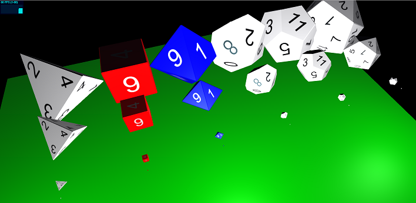
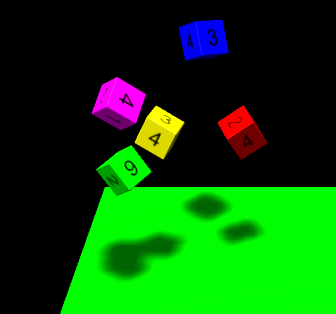
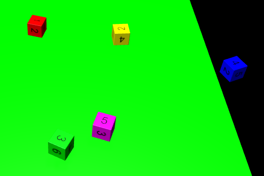

# threejs-dice

Create dice for your threejs scene and throw them on a specific side with cannonjs.

  

## Features
* 4/6/8/10/12/20 sided dice available
* Customize the appearance of the dice
* You can define the side/value, which should be upside after the die has fallen

## Demos
* [Types and sizes](./examples/types-and-sizes.html) - See the possible dice shapes and options (size / font color / back color)
* [Rolling](./examples/rolling.html) - See, how you can roll 5 dice, which will always land on the same sides

## Install

    npm install threejs-dice
    
## Usage

    
    
    
    
## Credits
Based on the "Online 3D dice roller" from http://a.teall.info/dice (http://www.teall.info/2014/01/online-3d-dice-roller.htm). Credits go to Anton Natarov, who published it under public domain.

"You can assume that it has the MIT license (or that else) if you wish so. I do not love any licenses at all and prefer to simply say that it is completely free =)" - Anton Natarov