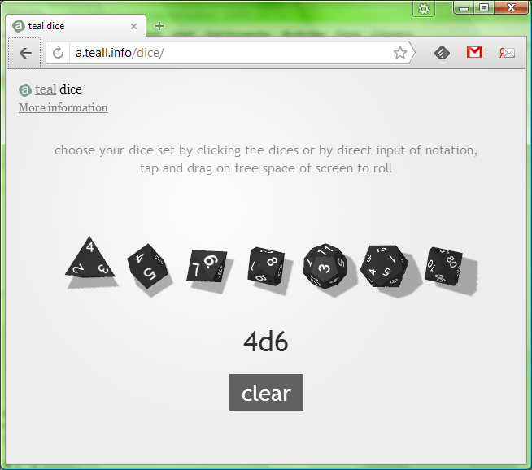

# threejs-dice

Based on the "Online 3D dice roller" from http://a.teall.info/dice (http://www.teall.info/2014/01/online-3d-dice-roller.htm). Credits go to Anton Natarov, who published it under public domain.

"You can assume that it has the MIT license (or that else) if you wish so. I do not love any licenses at all and prefer to simply say that it is completely free =)" - Anton Natarov